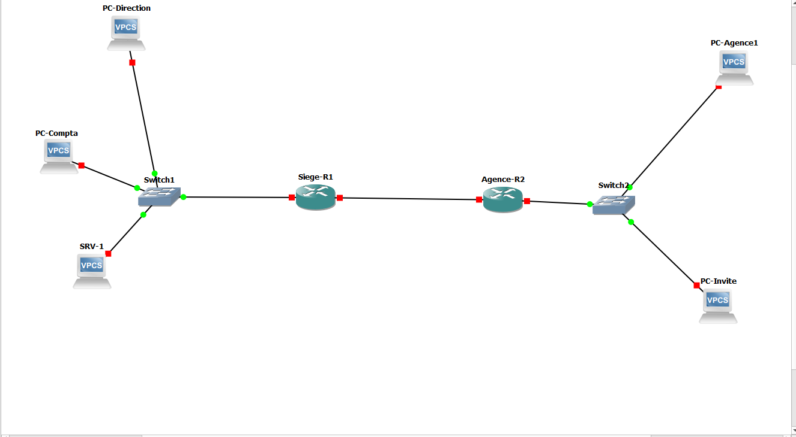
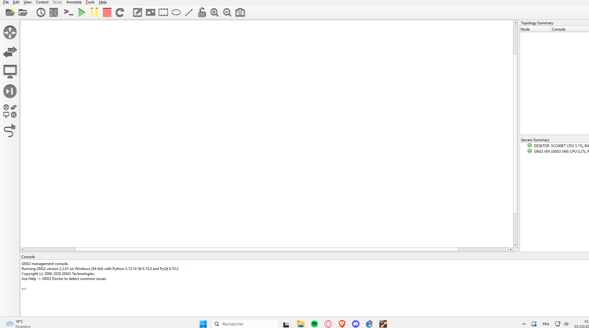
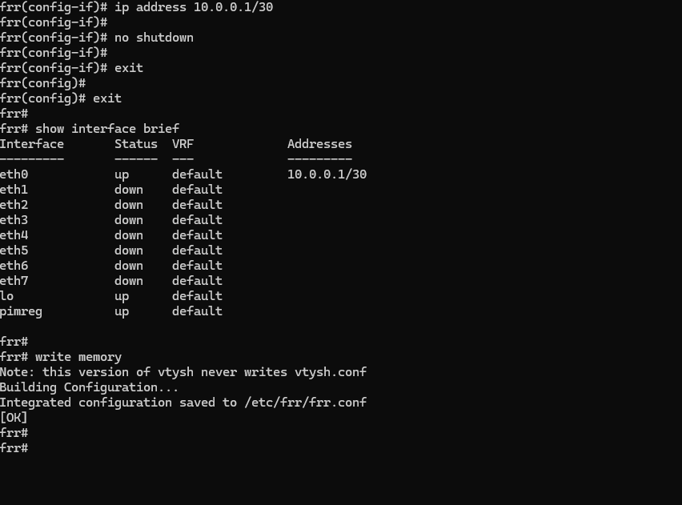
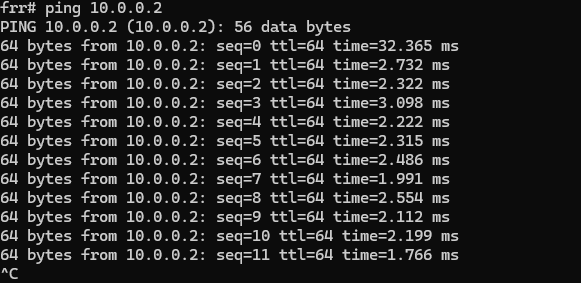
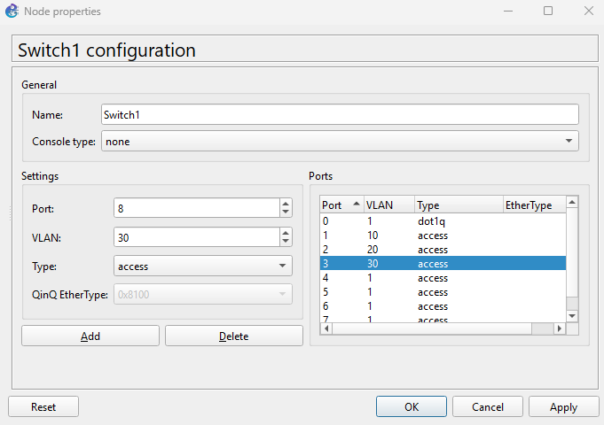
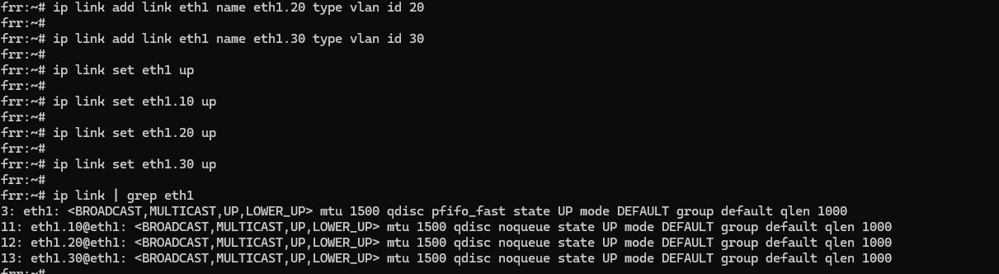
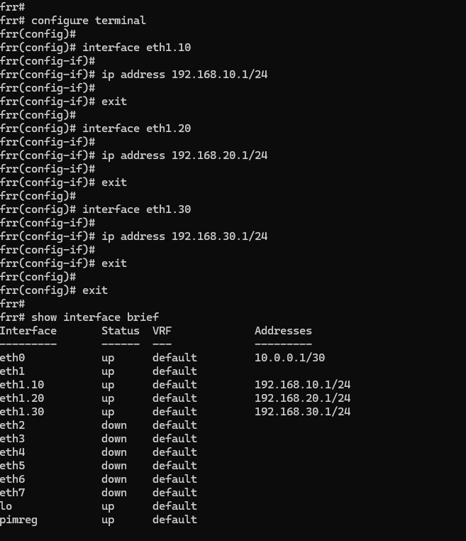
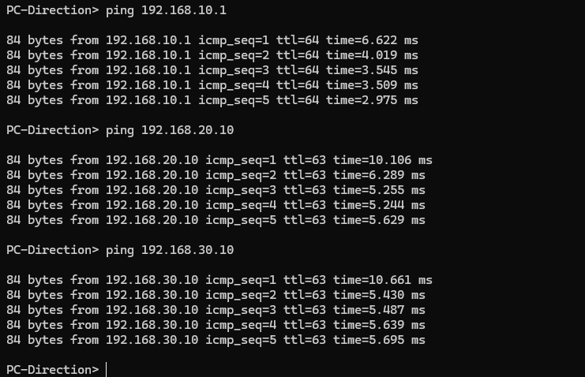

# Réseau d'une PME sur 2 sites (GNS3)

Projet personnel de conception et de mise en place d'une infrastructure réseau d'entreprise, entièrement virtualisée avec GNS3 : un siège et une agence reliés par un lien WAN, avec segmentation en VLAN et routage entre les réseaux.

> **État d'avancement** : le siège est opérationnel (VLAN, passerelles, routage inter-VLAN testé). La partie agence, OSPF, NAT, ACL et services réseau sont à venir (voir la section « Suite du projet »).

---

## 1. Objectifs

- Concevoir une architecture réseau simple et cohérente pour une petite entreprise sur deux sites
- Segmenter le réseau du siège par service (Direction, Compta/RH, Serveurs) grâce aux VLAN
- Faire communiquer les VLAN entre eux via un routeur
- Relier le siège et l'agence par un lien WAN et mettre en place le routage dynamique (OSPF)
- Documenter chaque étape, avec les tests et les problèmes rencontrés

## 2. Environnement

| Élément | Détail |
|---|---|
| Poste hôte | Windows 11, 16 Go de RAM, processeur à 12 threads |
| Simulateur | GNS3 2.2.61 |
| Hyperviseur | VirtualBox 7.2.20 |
| Serveur GNS3 | GNS3 VM (4 vCPU, 4 Go de RAM), accessible en `192.168.56.101` |
| Routeurs | FRRouting 8.2.2 (images QEMU) |
| Commutateurs | Ethernet switch intégré à GNS3 (VLAN 802.1Q) |
| Postes et serveur | VPCS (PC virtuels légers) |

## 3. Topologie

Équipements :

- `Siege-R1` : routeur du siège
- `Agence-R2` : routeur de l'agence
- `Switch1` (siège) et `Switch2` (agence)
- Siège : `PC-Direction`, `PC-Compta`, `SRV-1`
- Agence : `PC-Agence1`, `PC-Invite`



Câblage :

| De | Interface | Vers | Interface |
|---|---|---|---|
| Siege-R1 | eth0 | Agence-R2 | eth0 (lien WAN) |
| Siege-R1 | eth1 | Switch1 | Ethernet0 (trunk) |
| Switch1 | Ethernet1 | PC-Direction | Ethernet0 |
| Switch1 | Ethernet2 | PC-Compta | Ethernet0 |
| Switch1 | Ethernet3 | SRV-1 | Ethernet0 |
| Agence-R2 | eth1 | Switch2 | Ethernet0 (trunk) |
| Switch2 | Ethernet1 | PC-Agence1 | Ethernet0 |
| Switch2 | Ethernet2 | PC-Invite | Ethernet0 |

## 4. Plan d'adressage

**Lien WAN** : `10.0.0.0/30` (Siege-R1 `10.0.0.1`, Agence-R2 `10.0.0.2`)

**Siège**

| VLAN | Usage | Réseau | Passerelle | Poste |
|---|---|---|---|---|
| 10 | Direction | 192.168.10.0/24 | 192.168.10.1 | PC-Direction : 192.168.10.10 |
| 20 | Compta / RH | 192.168.20.0/24 | 192.168.20.1 | PC-Compta : 192.168.20.10 |
| 30 | Serveurs | 192.168.30.0/24 | 192.168.30.1 | SRV-1 : 192.168.30.10 |
| 99 | Management | 192.168.99.0/24 | 192.168.99.1 | (prévu, non encore utilisé) |

**Agence** (prévu)

| VLAN | Usage | Réseau | Passerelle |
|---|---|---|---|
| 10 | Utilisateurs | 192.168.110.0/24 | 192.168.110.1 |
| 20 | Invités | 192.168.120.0/24 | 192.168.120.1 |

Identifiants de routeur (OSPF, prévu) : `1.1.1.1` pour Siege-R1, `2.2.2.2` pour Agence-R2.

## 5. Mise en œuvre

### 5.1 Préparation de l'environnement

1. Installation de GNS3 et de VirtualBox, import de la GNS3 VM, installation de l'appareil FRR 8.2.2 depuis le catalogue GNS3.
2. Désactivation de l'accélération KVM, indisponible sur ce poste (voir la section « Problèmes rencontrés »).



### 5.2 Lien WAN entre les deux routeurs

Configuration de `eth0` sur chaque routeur (`10.0.0.1/30` et `10.0.0.2/30`), puis test de connectivité.

```
configure terminal
interface eth0
ip address 10.0.0.1/30
no shutdown
exit
exit
write memory
```




### 5.3 VLAN sur le commutateur du siège

Sur `Switch1` : le port 0 est en mode trunk (`dot1q`) vers le routeur, les ports 1, 2 et 3 sont en mode accès dans les VLAN 10, 20 et 30.

| Port | VLAN | Type | Connecté à |
|---|---|---|---|
| 0 | 1 | dot1q | Siege-R1 |
| 1 | 10 | access | PC-Direction |
| 2 | 20 | access | PC-Compta |
| 3 | 30 | access | SRV-1 |



### 5.4 Routage inter-VLAN (« router on a stick »)

Un seul câble relie le routeur au commutateur. Il est découpé en sous-interfaces, une par VLAN, qui servent de passerelles. Les sous-interfaces VLAN sont créées au niveau Linux du routeur, puis adressées dans FRR.

```
# Dans le shell Linux du routeur
ip link add link eth1 name eth1.10 type vlan id 10
ip link add link eth1 name eth1.20 type vlan id 20
ip link add link eth1 name eth1.30 type vlan id 30
ip link set eth1 up
ip link set eth1.10 up
ip link set eth1.20 up
ip link set eth1.30 up
```

```
# Dans vtysh (configuration FRR)
configure terminal
interface eth1.10
ip address 192.168.10.1/24
exit
interface eth1.20
ip address 192.168.20.1/24
exit
interface eth1.30
ip address 192.168.30.1/24
exit
exit
write memory
```




### 5.5 Configuration des postes (VPCS)

```
PC-Direction> ip 192.168.10.10 255.255.255.0 192.168.10.1
PC-Compta>    ip 192.168.20.10 255.255.255.0 192.168.20.1
SRV-1>        ip 192.168.30.10 255.255.255.0 192.168.30.1
```

## 6. Tests et validation

| Test | Résultat |
|---|---|
| Siege-R1 vers Agence-R2 (`10.0.0.2`) | OK, environ 2 ms |
| PC-Direction vers sa passerelle (`192.168.10.1`) | OK, TTL 64 |
| PC-Direction vers PC-Compta (`192.168.20.10`) | OK, TTL 63 |
| PC-Direction vers SRV-1 (`192.168.30.10`) | OK, TTL 63 |

Le TTL de 64 vers la passerelle puis de 63 vers un autre VLAN montre que les paquets traversent bien un routeur supplémentaire : le routage entre VLAN fonctionne.




## 7. Problèmes rencontrés et solutions

| Problème | Cause | Solution |
|---|---|---|
| Les routeurs refusaient de démarrer (« KVM acceleration cannot be used ») | Pas d'accélération matérielle KVM dans la GNS3 VM | Ajout de `enable_kvm = False` dans la section `[Qemu]` de `/opt/gns3/server/gns3_server.conf`, puis redémarrage de la VM |
| Console de routeur vide ou sans réponse | Le client console par défaut ne s'ouvrait pas correctement | Activation du client Telnet de Windows et connexion avec `telnet 192.168.56.101 <port>` |
| GNS3 gelé, VM plantée (`soft lockup`) | Émulation sans KVM trop gourmande pour une VM à 2 vCPU, avec plusieurs équipements démarrés en même temps | Passage de la VM à 4 vCPU et démarrage des routeurs un par un |
| Commande `start-shell` inconnue dans FRR | Cette version de l'appareil ne la fournit pas | Accès au shell Linux avec `exit` depuis vtysh, retour avec la commande `vtysh` |

## 8. Limites connues

- Les sous-interfaces VLAN créées avec `ip link` ne survivent pas à un redémarrage du routeur. Elles seront rendues permanentes (script de démarrage) dans une prochaine étape.
- L'absence de KVM ralentit fortement le démarrage des routeurs (3 à 4 minutes chacun).

## 9. Suite du projet

- [ ] Agence : sous-interfaces VLAN sur Agence-R2, configuration de Switch2 et des postes
- [ ] Routage dynamique OSPF entre les deux sites
- [ ] DHCP et DNS
- [ ] NAT vers un accès « Internet » simulé
- [ ] Filtrage entre VLAN avec des ACL
- [ ] VPN site à site
- [ ] Supervision et sauvegarde des configurations
- [ ] Rendre les VLAN persistants au démarrage
